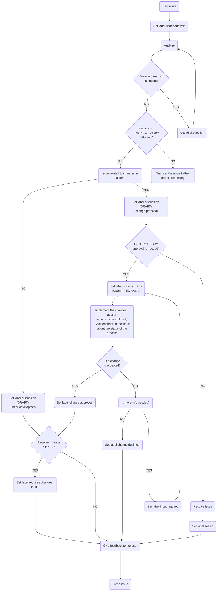

# Helpdesk-registry / helpdesk management

## Introduction

The establishment of proper communication with the INSPIRE Registry community is a key asset for the operation, maintenance and update of the INSPIRE Registry. The helpdesk of the INSPIRE Registry is the core of the communication strategy since it is the platform where users can report change proposals, nominate a Control body member or a Submission organisation, issues, questions or new features on the Registry.  The objective of this document is to illustrate the systematic workflow adopted by the INSPIRE Registry team to organize, address and manage the issues reported by users in the Registry helpdesk.

## Helpdesk management workflow

The helpdesk management workflow defines the actions performed by the INSPIRE Registry team to address and solve the problems reported by the users of the INSPIRE Registry. The workflow makes use of a number of GitHub artefacts: labels, milestones, status and the project boards.

### GitHub labels

To be able to know the status of each issue reported in the helpdesk (from the initial assessment to the final implementation of a solution for it), a number of labels are used. These are listed on this page (link a la página de labels) and are described in more detail below in the chronological order in which they are used while managing each Registry issue:

- under analysis: this label is assigned after the issue has been opened, and indicates that the INSPIRE Registry Team is performing a first analysis to figure out what is the problem and how to address it; in case this requires further information from the user, the INSPIRE Registry Team asks the user to provide it in the issue discussion.

- question: In case the issue requires further information from the user, the INSPIRE Registry Team asks the user to provide it in the issue.
- discussion/under development: in case the initial analysis reveals that a change in the INSPIRE Registry is needed, this label is assigned to the issue to indicate that the INSPIRE Registry team is developing a solution for the problem reported.
- discussion/change proposal: this label is assigned to the issue, in case the initial analysis reveals that is a change proposal for the registry, then the issue is under a deeper analysis to see the impact on the registry and whether it is a proposal made by a Submitting organization or not.
- solved: If the change proposal does not need the Control body's approval, the INSPIRE Registry Team will proceed to implement the proposal and will label the issue as solved.
- under scrutiny: This label is assigned to the issue, to indicate that the change proposal is under the implementation of the changes and accepts actions by the Control body. During this process, INSPIRE Registry Team will give feedback on the status of the proposal to the user. Once the control body has communicated its decision, the issue can be labelled under one of these 3 labels:
  - input required: The control body is requesting additional information on the change request
  - change approved: The change request has been approved by the control body
  - change declined: The change request has been declined by the control body.
- Requires change in TG: Finally, when the change, approved by the Control body, affects the technical guideline, the issue will be labelled in order to be taken into account in the technical-guidelines helpdesk.

The diagram below shows the full helpdesk management cycle for each issue, from the initial stage when it is opened to the final stage when it is closed.  Also includes and identifies the actions of the INSPIRE Registry team.

