# Helpdesk-registry / helpdesk management

## Introduction

The establishment of proper communication with the INSPIRE Registry community is a key asset for the operation, maintenance and update of the INSPIRE Registry. The [helpdesk of the INSPIRE Registry](https://github.com/INSPIRE-MIF/helpdesk-registry/issues) is the core of the communication strategy since it is the platform where users can report change proposals, nominate a Control body member or a Submission organisation, issues, questions or new features on the Registry.  The objective of this document is to illustrate the systematic workflow adopted by the INSPIRE Registry team to organize, address and manage the issues reported by users in the Registry helpdesk.

## Helpdesk management workflow

The helpdesk management workflow defines the actions performed by the INSPIRE Registry team to address and solve the problems reported by the users of the INSPIRE Registry. The workflow makes use of a number of GitHub artefacts: labels, milestones, status and the project boards.

### GitHub labels

To be able to know the status of each issue reported in the helpdesk (from the initial assessment to the final implementation of a solution for it), a number of labels are used. These are listed on [this page](https://github.com/INSPIRE-MIF/helpdesk-registry/issues/labels) and are described in more detail below in the chronological order in which they are used while managing each Registry issue:

- **_under analysis_**: This label is assigned after the issue has been opened, and indicates that the INSPIRE Registry Team is performing an initial analysis to figure out what the nature of the problem is, and how to address it.
- **_further info required_**: In case the issue requires further information from the user, the INSPIRE Registry Team asks the user to provide it in the issue thread.
- **_change proposal_**: This label is assigned to the issue in case the initial analysis reveals that it corresponds to a change proposal regarding the content of the INSPIRE Registry. After having classified the issue with this label, a deeper analysis is started to evaluate whether it is a proposal deriving from a Submitting Organization or not, and its expected impact on the INSPIRE Registry.
- **_miscellaneous proposal_**: In case the initial analysis reveals that the issue does NOT correspond to a change proposal regarding the content of the INSPIRE Registry, but to another type of proposal, this label is assigned to the issue. As an illustration, the proposal might be regarded to a problem, a question or a proposal related to the the INSPIRE Registry tool/application. In these cases, the INSPIRE Registry team shall analyse the nature of the issue, as well as formulate/develop a proper answer and/or solution to the issue reported.
- **_under development_**: In the previous case, when an ad-hoc solution needs to be developed, this label is assigned to the issue to indicate that the INSPIRE Registry team is developing a solution for the problem reported.
- **_accepted fix_**: If the change proposal is a correction directly implementable and does not require the Control Body's approval, for example in case of obvious typos, the INSPIRE Registry team will proceed to implement the proposal and will label the issue as an accepted correction.
- **_impact on TG_**: Finally, when the change affects any technical guidelines, the issue is labelled in order to properly identify and address it within the technical guidelines helpdesk.

The diagram below shows the full helpdesk management cycle for each issue, from the initial stage when it is opened to the final stage when it is closed. It additionally includes and identifies the actions of the INSPIRE Registry team.

```mermaid
%%{init: {"themeVariables": {"fontSize": "14px" }}}%%
flowchart TD

    %% RELATIONS
    newIssue -->  labelUnderAnalysis -->  analyze -->
    rhombusMoreInfo -- NO  ---->  rhombusIsAnIssue -- YES -->  rhombusChangesInDB -- NO --> labelDiscussionDevelopment
    rhombusMoreInfo -- YES -->  labelQuestion --> labelQuestionsFor --> analyze

    rhombusChangesInDB -- YES --> labelDiscussionProposal
    labelDiscussionProposal --> rhombusControlBody 
       
    %% rhombusControlBody -- YES --> labelUnderScrut
    rhombusControlBody -- YES --> labelGovernanceProcess
    %% labelInputRequired --> labelUnderScrut
    %% labelUnderScrut --> implementChanges
    labelGovernanceProcess --> giveFeedBack

    rhombusControlBody -- NO --> resolveIssue
    resolveIssue --> labelSolved
    labelSolved --> giveFeedBack
    
    %% implementChanges --> rhombusChangeAccepted
    %% rhombusChangeAccepted -- YES --> labelChangeApproved
    %% rhombusChangeAccepted -- YES WITH CHANGES --> labelChangeApprovedWithChanges
    %% rhombusChangeAccepted -- NO --> NeedMoreInfo

    %% NeedMoreInfo -- NO --> labelChangeDeclined

    %% NeedMoreInfo -- YES ----> labelInputRequired

    %% labelChangeDeclined --> giveFeedBack
    %% labelChangeApproved --> rhombusRequiresChange
    %% labelChangeApprovedWithChanges --> rhombusRequiresChange
    labelDiscussionDevelopment --> rhombusRequiresChange

    rhombusRequiresChange -- YES --> labelRequiresChanges
    labelRequiresChanges ----> giveFeedBack
    rhombusRequiresChange -- NO --> giveFeedBack
  
    rhombusIsAnIssue -- NO --> rhombusCouldBeTransfered
    rhombusCouldBeTransfered -- NO --> giveFeedBack
    rhombusCouldBeTransfered -- YES --> transferIssue


    giveFeedBack ----> closeIssue

    %% NEW ISSUE [NODE]
    newIssue("New issue")

    %% SET LABEL UNDER ANALYSIS [NODE]
    labelUnderAnalysis("Set label 'under analysis'")
    style labelUnderAnalysis stroke-width:4px, stroke: #006b75

    %% ANALYZE [NODE]
    analyze("Analyze")

    %% MORE INFORMATION IS NEEDED [RHOMBUS]
    rhombusMoreInfo{"More information \n is needed"}

    %% SET LABEL QUESTION [NODE]
    labelQuestion("Set label 'further info required'")
    style labelQuestion stroke-width:4px, stroke: #d876e3

    %% IS AN ISSUE IN INSPIRE REGISTRY HELPDESK? [RHOMBUS]
    rhombusIsAnIssue{"Is an issue in \n INSPIRE Registry \n Helpdesk?"}

    %% SET LABEL DISCUSSION (DRAFT) UNDER DEV [NODE]
    labelDiscussionDevelopment("Set label 'miscellaneous proposal' \n + add workflow for 'under development'")
    style labelDiscussionDevelopment stroke-width:4px, stroke: #ed7d31

    %% SET LABEL DISCUSSION (DRAFT) UNDER PROP [NODE]
    labelDiscussionProposal("Set label 'change proposal'")
    style labelDiscussionProposal stroke-width:4px, stroke: #c2e0c6

    %% CONTROL BODY APPROVAL IS NEEDED ? [RHOMBUS]
    rhombusControlBody{"MIWP Sub-group \n approval is needed?"}

    %% SET LABEL UNDER SCRUTINY (SUBMITTED-VALID) [NODE]
    %% labelUnderScrut("Proposal submitted to Control Body \n Set label 'under scrutiny'")
    %% style labelUnderScrut stroke-width:4px, stroke: #fbca04

    %% SET LABEL UNDER SCRUTINY (SUBMITTED-VALID) [NODE]
    labelGovernanceProcess("GOVERNDANCE PROCESS")
    style labelGovernanceProcess stroke-width:4px, stroke: #fbca04, stroke-dasharray: 5 5, fill:#f96

    %% IMPLEMENT THE CHANGES / ACCEPT... [NODE]
    %% implementChanges("Implement the changes / accept \n actions by control body. \n Give feedback in the issue \n about the status of the process")

    %% THE CHANGE IS ACCEPTED ? [RHOMBUS]
    %% rhombusChangeAccepted{"The change \n is accepted?"}

    %% SET LABEL INPUT REQUIRED [NODE]
    %% labelInputRequired("Set label 'input required'")
    %% style labelInputRequired stroke-width:4px, stroke: #f9d0c4

    %% SET LABEL CHANGE APPROVED [NODE]
    %% labelChangeApproved("Proposal is accepted \n Implement change \n Set label 'approved'")
    %% style labelChangeApproved stroke-width:4px, stroke: #0e8a16

    %% SET LABEL CHANGE APPROVED WITH CHANGES [NODE]
    %% labelChangeApprovedWithChanges("Proposal is accepted \n Implement change \n Set label 'approved with changes'")
    %% style labelChangeApprovedWithChanges stroke-width:4px, stroke: #0e8a16

    %% REQUIRES CHANGE IN THE TG? [RHOMBUS]
    rhombusRequiresChange{"Requires change \n in the TG?"}

    %% SET LABEL CHANGE DECLINED
    %% labelChangeDeclined("Proposal is NOT accepted \n Set label 'rejected'")
    %% style labelChangeDeclined stroke-width:4px, stroke: #b60205

    %% SET LABEL REQUIRES CHANGES IN TG
    labelRequiresChanges("Requires changes in TG \n Set label 'impact on TG'")
    style labelRequiresChanges stroke-width:4px, stroke: #d97e5c

    %% GIVE FEEDBACK TO THE USER
    giveFeedBack("Give feedback to the user")

    %% CLOSE ISSUE 
    closeIssue("Close issue")

    %% RESOLVE ISSUE 
    resolveIssue("Implement change")

    %% SET LABEL SOLVED
    labelSolved("Fix is accepted \n Set label 'ACCEPTED FIX'")
    style labelSolved stroke-width:4px, stroke: #8ef984

    %% TRANSFER THE ISSUE TO THE CORRECT REPOSITORY
    transferIssue("Transfer the issue to the correct helpdesk repository")

    %% IS MORE INFO NEEDED?
    %% NeedMoreInfo{"Is more info needed?"}

    %% ISSUE RELATED TO CHANGES IN A ITEM [RHOMBUS]
    rhombusChangesInDB{"Issue related to\nchanges in a item"}

    %% QUESTIONS FOR
    labelQuestionsFor("Requires input\n by users and/or the Inspire \nRegistry team")

    rhombusCouldBeTransfered{"Could be transfered to\n an other repository?"}
```

